# 《岳桩山》项目审阅与优化记录

审阅日期：2026-10-04。范围：权威文档、数据层、共享状态与输入逻辑、静态页面源码，以及主线和论坛的浏览器走查。

项目已经具备完整的调查推进链和鲜明的独立站点风格。本轮优先修复影响解谜公平性、进度可靠性和无障碍的问题，保留 Vite + TypeScript 静态多页面架构。

## 已实施的高优先改进

| 优先级 | 问题与影响 | 本轮处理 | 证据与验证 |
| --- | --- | --- | --- |
| P1 | 实验室门禁通过后可提前进入监控，跳过“理想容器”档案；布局样式还能覆盖 `hidden`，提前显示按钮 | P10 同时依赖 P09 和关键档案已读；监控入口与处理函数双重门控；公共样式保证隐藏状态生效 | 页面回归测试、浏览器门禁→档案→监控走查；步骤 5 |
| P1 | P07 自动隐藏照片和解释，慢读或减少动态用户可能错过证据 | 保留照片、时间戳和三条矛盾解释，玩家点“继续调查”后才开放第二阶段 | 减少动态下推进 20 秒仍保留照片的测试；步骤 5 |
| P1 | 首页重开后残留收藏入口、邮件提示；已读状态下重绘存在失效 DOM 风险 | 重开后重新渲染收藏、手记与邮件提示；首页和邮箱共用可见邮件及未读计数规则 | 重复重开、已读与新增邮件测试；步骤 1、2 |
| P1 | 损坏存档中的错误字段类型会进入运行状态；存储被禁用时读写可能抛错 | 逐字段校验、过滤无效数组值、约束计数/音量/开关；导入无效根对象或未来版本时拒绝覆盖；存储不可用时保留内存状态 | 13 项存档测试，含隐私模式和跨标签缓存失效 |
| P1 | 游戏设置没有完整覆盖系统减少动态偏好；默认静音仍可创建音频并请求大型资源 | 共用游戏与系统偏好；减少动态跳过自动滚动；静音时延迟创建 Audio，只保留循环播放意图 | 5 项动态偏好测试、3 项音效测试 |
| P1 | 设置与手记弹层缺少原生焦点约束和 Escape 关闭；窄屏布局出现横向溢出 | 使用原生 dialog，约束高度、允许内部滚动；修复窄屏网格最小宽度和搜索分类间距 | 浏览器 Escape 后焦点返回入口；375×667 设置弹层截图 |
| P1 | P07 与第二阶段事件时间早于 08:00 调查开始；旧相对离线时长及数处时间说明冲突 | P07 改为 08:52，第二阶段改为同日上午；显示最后在线绝对时间；对齐门禁内层标题、19:42 消息说明、周案帖子日期及当日搜救文案 | timeline.md 与数据同步，时间回归测试；步骤 3、4、5 |
| P2 | 论坛重复检索累积审查提示，全文检索没有共用标准化路径 | 复用单条提示，普通检索清除提示，检索返回列表；全文匹配共用标准化与有限同义词表 | “失 踪”“管 道”及重复搜索测试；步骤 4 |
| P2 | 首页普通检索和演示入口可能带玩家离开虚构作品；邮件到达需刷新才显示 | 检索已收录的本地站点，演示项目显示本地反馈；邀请函触发的新邮件立即重绘 | 本地搜索不修改存档、页面无现实外链、新邮件即时出现测试 |
| P2 | 发布图片体积较大；监控图片在入口尚不可用时就被加载 | 发布引用切换为无损 WebP，保留 PNG 源图；监控图片实际打开时才赋值 | 9 张图片逐图解码 RGBA 像素一致；16,402,330 → 11,687,080 字节，减少 28.7% |
| P2 | 结局回选可能混入旧收尾内容，提示误称其他结局也已收集；部分剧情散落 HTML | 切换结局清理旧面板，回选恢复焦点；提示只承诺记录已见结局；迁移监控推进文案和选择引言至 content.ts | 实机提交→回选→销毁；步骤 6 |

## 浏览器走查：六组步骤

截图全部来自本轮本地运行，下面将相邻页面归为一组。编号代表报告阅读顺序，文件名编号代表截图采集顺序。

### 1. 首页、设置与调查手记 — 已修复，可用

首页的虚构导航风格和收藏入口清楚。添加可见的简短内容提醒；普通演示项目留在本地。重复重开会同步收藏、手记入口和未读数字。设置打开后焦点进入关闭按钮，Escape 后返回入口；窄屏弹层完整落在视口内。

限制：只检查了桌面及 375×667 窄屏，尚未覆盖所有手机浏览器和屏幕阅读器。

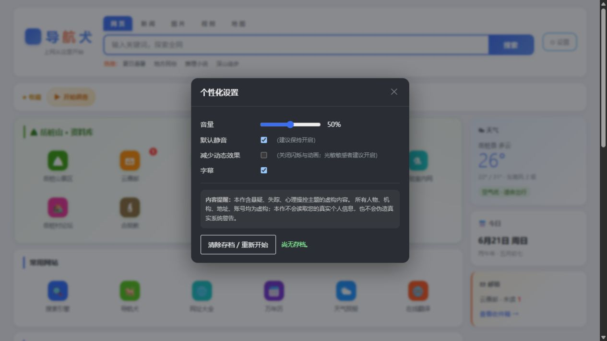

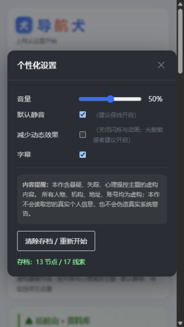

### 2. 邮件与聊天 — 主线可用，重入体验可继续改进

邮箱的邀请函、账号和日程可形成明确的开场任务。首页与邮箱统一计算可见的未读收件箱邮件；读邀请后新增邮件立即出现。聊天已走到离线节点，饮用水、右手与“芝麻”信息能支持后续推理。

剩余问题：聊天页重入会从第一轮对话重播；置顶的 19:15 账号线索与下方 18:30 聊天之间缺少“置顶记录”标注。建议下一轮保存对话游标或提供已读记录回看，并标注置顶内容。

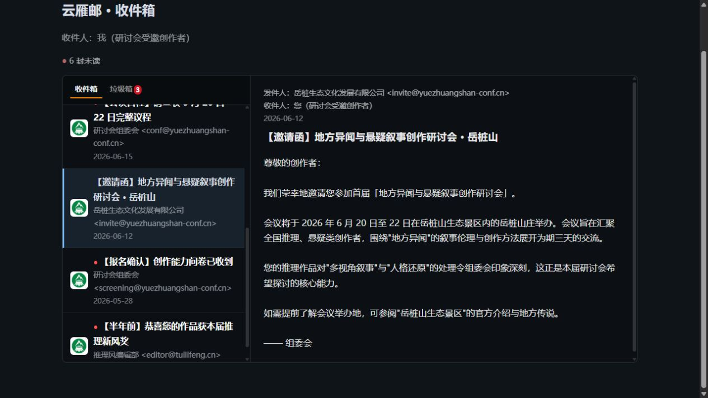

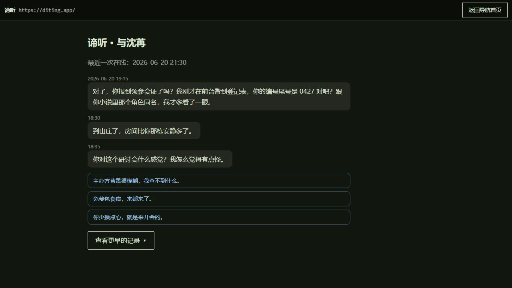

### 3. 新闻与工作台 — 可用，时间说明已对齐

“失踪”检索能找到被改写的报道，再推进到工作台。实机验证 `0427-YWYXXSC` 等价口令可登录；重入恢复已登录记录。保留“自行失足/自愿返回”的故意矛盾，修复当日文章提前叙述三日搜救结果、19:42 被误称最后正常消息，以及 02:11 监控标题误写外层等无意矛盾。

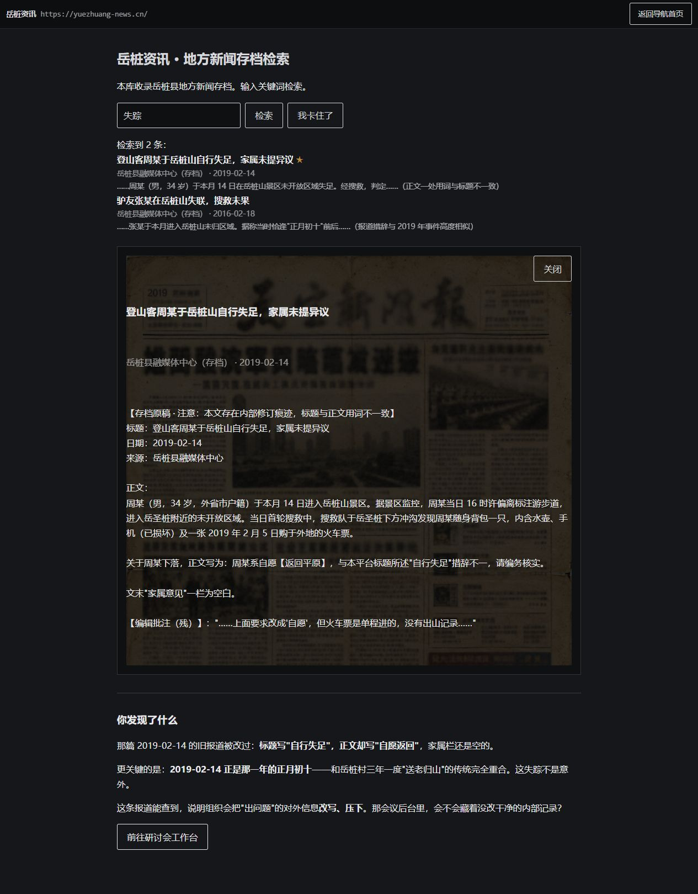

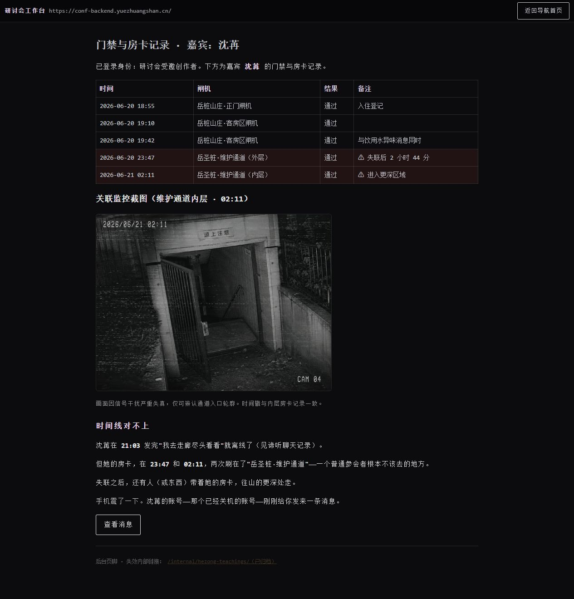

### 4. 论坛 — 已修复，可用

原本连续搜索“失踪”会出现两条审查通知。现在“失 踪”等分隔写法按同一路径匹配，通知保持一条；检索普通关键词时移除。从帖子详情发起检索会返回结果列表。2019 年周案转述帖的日期和标题已对齐同期事件。

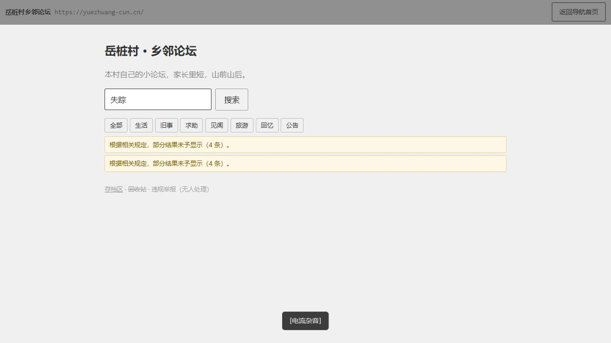

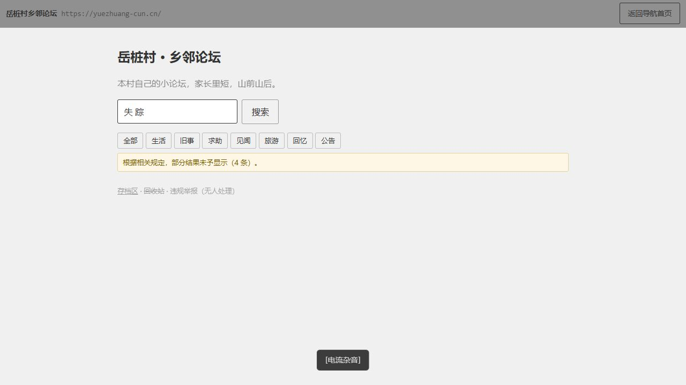

### 5. 照片证据与实验室 — 流程已修复，视觉证据待增强

P07 的照片和三条矛盾解释能持续阅读，主动继续后才显示实验室收藏入口。实机验证全角身份码 `ＬＸＺ－Ｂ０７`，门禁通过后只显示档案检索；读适配性评估后开放监控，补读主体局限日志后清除防漏提示；重入可恢复已读监控。

剩余问题：当前监控图主要呈现通道，没有清楚可辨认的按闸机人物与左手动作。文字保证线索可读，但画面本身不足以支撑视觉推理。建议制作对应静态证据图，同时保留文字等价描述。

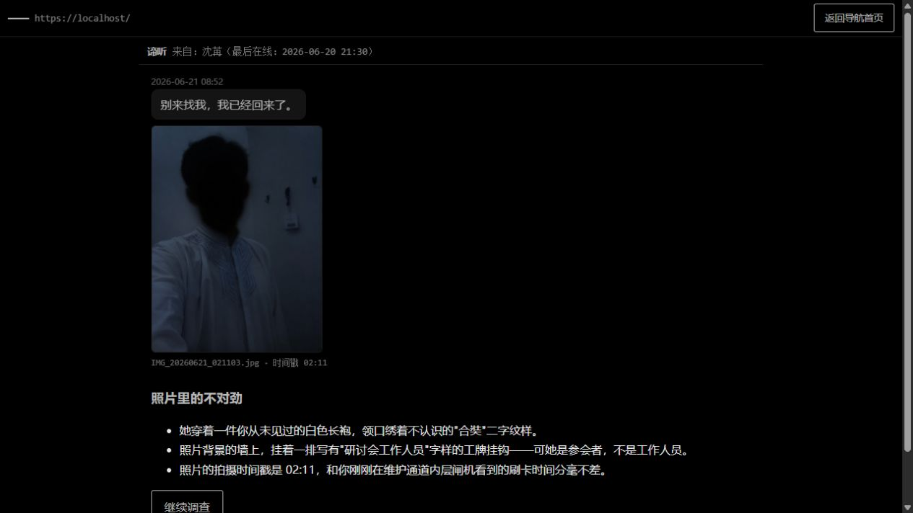

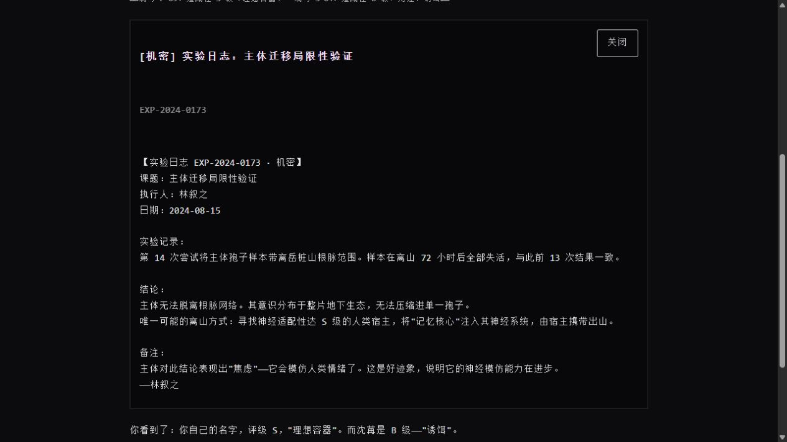

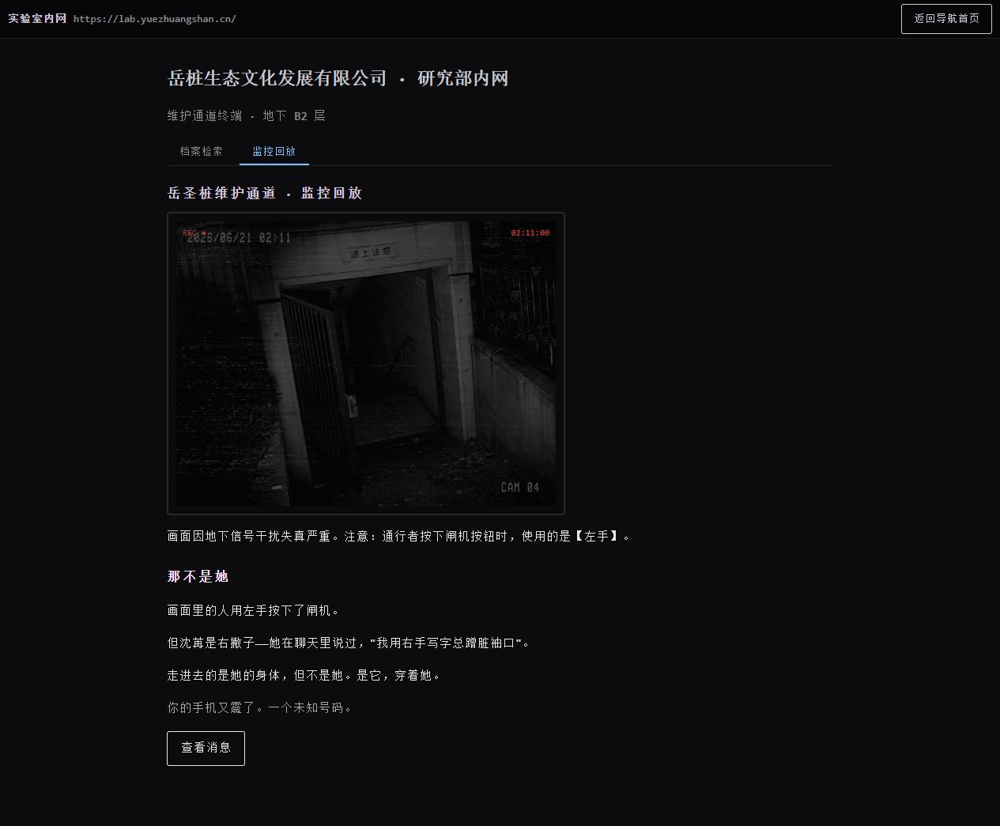

### 6. 真假消息与最终选择 — 可用，回选已验证

选择带“芝麻”私密记忆的消息可解锁最终选择；未选择时确认按钮禁用。实机体验提交结局后回到选择，焦点返回第一项，再选择销毁；已见路线标记与未见路线保持区分。结尾收尾和真相面板在每次选择时重置。

限制：“成为容器”路线的文本、状态逻辑已审阅并有既有测试，未在本轮浏览器完整等待该路线演出。

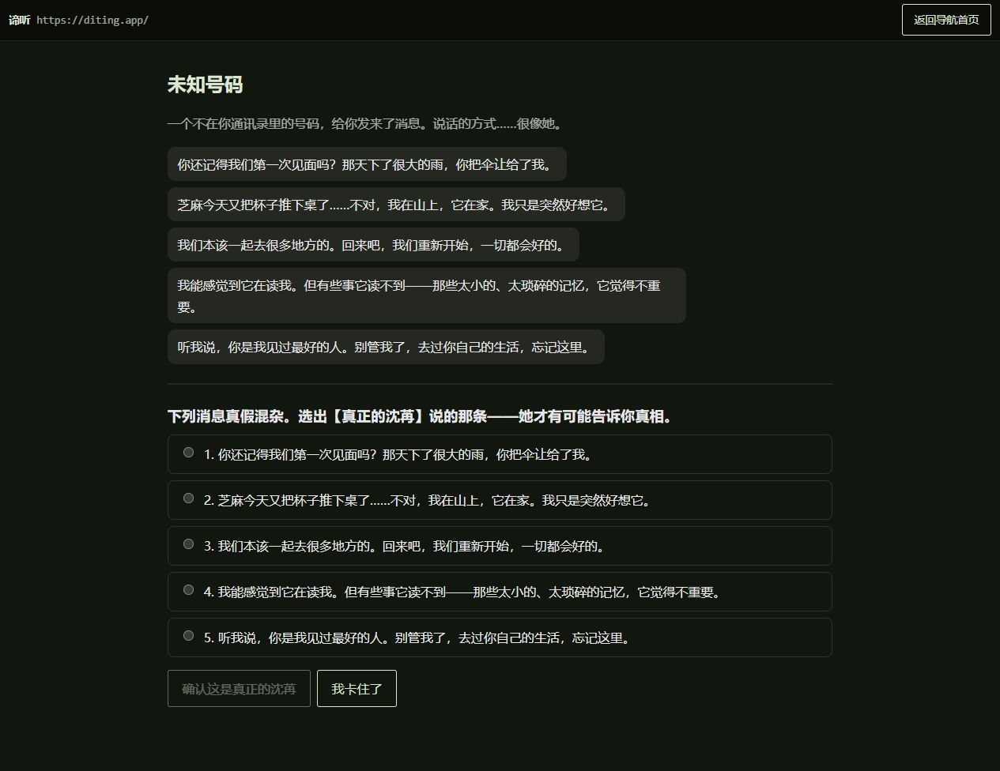

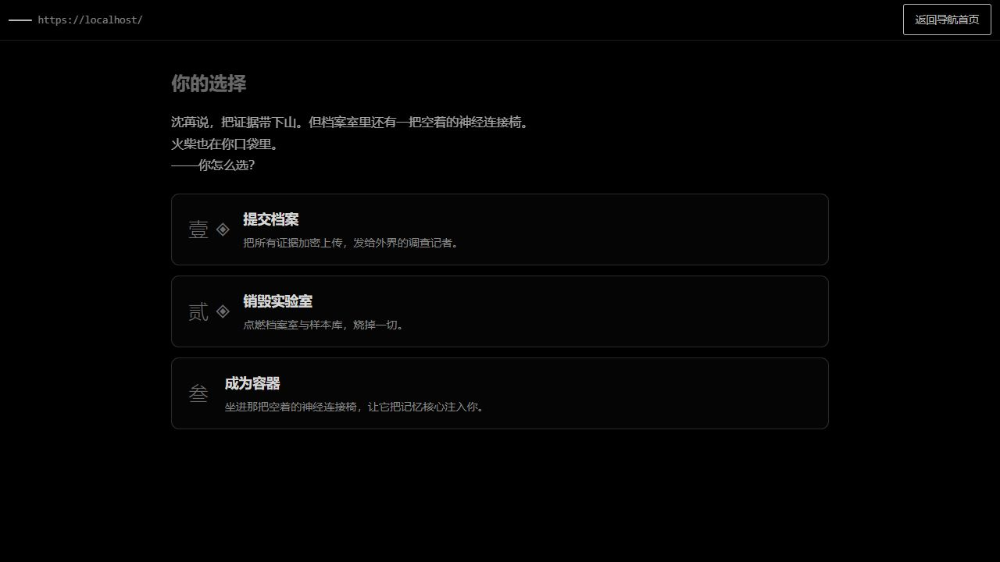

## 验证与交付

- 基线为 119 项测试，本轮共 157 项，12 个测试文件全部通过。
- 类型检查和生产构建通过，12 个 HTML 入口均成功产出。
- `git diff --check` 通过。
- 保持静态多页面架构，没有增加运行时依赖。剧情与提示改动先同步文档，再落入数据与页面。
- PNG 源图保留，发布只引用 WebP。可选维护脚本 `scripts/optimize_assets.py` 校验每张图的解码像素完全一致，常规构建不依赖 Python。
- 存档跨标签处理只使缓存失效，并不自动重绘已打开页面；本轮未声称提供多标签实时同步或事务合并。
- 浏览器走查基于开发预览；生产包已构建验证，尚未逐页在生产预览和多个浏览器上复跑。本轮也不是完整 WCAG 合规审计。
- 最后恢复预览服务后，浏览器自动控制未能再次触发设置入口，未确认将测试存档清回开场；交付预览保留走查进度。前述流程结论来自恢复前完成的实机操作、已保存截图与最终回归测试，重连后的交互状态仍需人工确认。

## 下一轮建议

| 顺序 | 建议 | 理由与验收标准 |
| --- | --- | --- |
| 1 | 补足监控图的左手动作与照片细节 | 不依赖推进说明也能观察破绽；仍提供等价文字描述，保留解谜公平性 |
| 2 | 压缩音频与生成小尺寸图标/头像 | 四个 WAV 总计约 19.6 MB；favicon 发布图仍约 589 kB。压缩后确认循环接缝、字幕对应及播放效果 |
| 3 | 保存聊天游标，改善已读记录回看 | 返回聊天页能继续或查看已读记录；置顶线索有明确标记，不制造意外时间矛盾 |
| 4 | 补充生产预览、移动设备与辅助技术试玩 | 覆盖低网速、键盘全流程、屏幕阅读器和三种结局；统计卡点后再调整提示强度 |

本轮未增加新的谜题、证据板或剧情分支。以上剩余项已明确区分于已经完成的修复。
